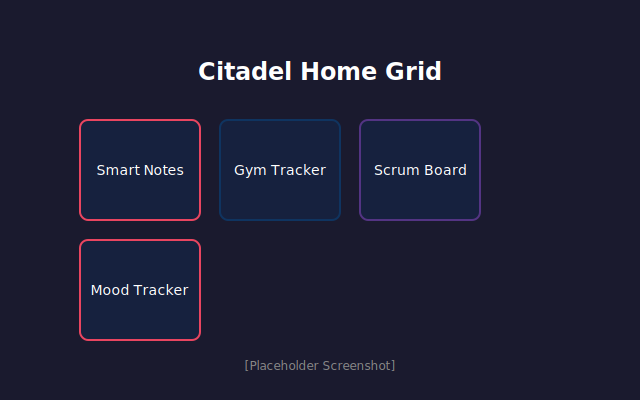
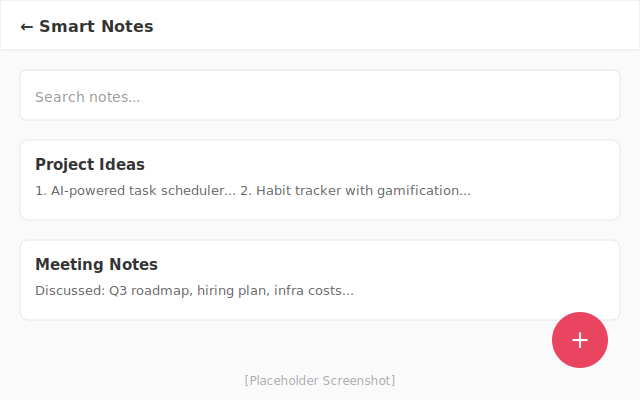
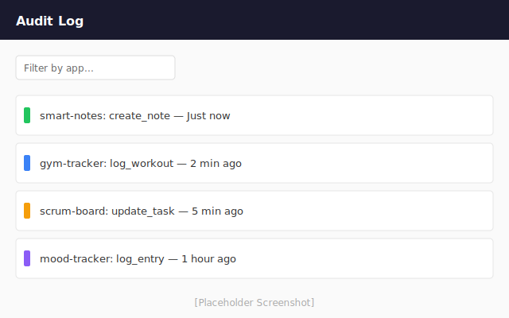
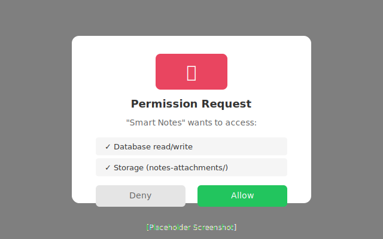

<p align="center">
  <picture>
    <source media="(prefers-color-scheme: dark)" srcset="docs/public/images/citadel-logo-dark.svg">
    
  </picture>
</p>

<h1 align="center">Citadel</h1>

<p align="center">
  <strong>Local-first personal app hub.</strong><br>
  One host, isolated apps, your data stays on your machine.
</p>

<p align="center">
  <a href="LICENSE"></a>
</p>

<p align="center">
  <a href="docs/what-is-citadel.md">What is Citadel?</a> ·
  <a href="docs/intro.md">Docs</a> ·
  <a href="docs/how-to/quickstart.md">Quickstart</a> ·
  <a href="docs/how-to/build-an-app.md">Build an App</a> ·
  <a href="docs/app-spec.md">App Spec</a> ·
  <a href="kb/ROADMAP.md">Roadmap</a>
</p>

---

## Quick start

Runtime: **Node >= 22**.

```bash
cd host && npm install && npm run dev
# → http://localhost:3000
```

## Create an app

```bash
node scripts/citadel-app.mjs create my-app --template=crud
```

Templates: `blank` · `crud` · `ai` · `dashboard` — [CLI docs](docs/cli.md)

## How it works

```
Browser → Middleware (CSP, rate limit) → App routes → @citadel/core → SQLite (per app)
```

Each app gets its own database and storage. Apps declare permissions in `app.yaml` — the host enforces them. No cross-app access. Everything is audited.

```
host/       → Next.js control plane
core/       → @citadel/core (db, storage, audit, permissions)
apps/       → App packages (manifest + migrations)
templates/  → Starter templates
scripts/    → citadel-app CLI
```

## Built-in apps

Smart Notes · Gym Tracker · Scrum Board · French Translator · Friend Tracker · Promo Kit · Mood Tracker

## Screenshots

<p align="center">
  <em>Visual overview of Citadel at a glance</em>
</p>

### Home Grid
The main dashboard showing all installed apps:


*The Citadel home page displays installed apps in a clean grid layout*

### App View (Smart Notes)
Example of an app running inside Citadel:


*Smart Notes — a note-taking app with AI-powered features*

### Audit Viewer
Track every action across all apps:


*Complete audit trail of app actions with filtering and search*

### Permission Consent
Apps request permissions before accessing data:


*Explicit user consent for app permissions*

## Architecture

```mermaid
graph TB
    Browser[Browser] -->|HTTP/WebSocket| Middleware[Host Middleware<br/>CSP / Rate Limit / Auth]
    Middleware --> NextApp[Next.js App Router]
    
    subgraph Host["Citadel Host (Next.js)"]
        NextApp --> AppRoutes[App Routes<br/>/apps/:appId]
        NextApp --> APIRoutes[API Routes<br/>/api/apps/:appId]
        NextApp --> CoreLib[@citadel/core]
    end
    
    subgraph Core["Core Services"]
        CoreLib --> DB[Database Layer]
        CoreLib --> Storage[Storage Layer]
        CoreLib --> Audit[Audit Logger]
        CoreLib --> Permissions[Permission Engine]
    end
    
    subgraph Isolation["Per-App Isolation"]
        DB -->|SQLite| AppDB1[(Smart Notes DB)]
        DB -->|SQLite| AppDB2[(Gym Tracker DB)]
        DB -->|SQLite| AppDB3[(Scrum Board DB)]
        Storage -->|Filesystem| AppStorage1[/Smart Notes/]
        Storage -->|Filesystem| AppStorage2[/Gym Tracker/]
    end
    
    style Host fill:#f9f,stroke:#333
    style Core fill:#bbf,stroke:#333
    style Isolation fill:#bfb,stroke:#333
```

**Key architectural principles:**
- **Host-isolated**: Each app runs in its own database and storage sandbox
- **Permissioned**: Apps declare required permissions; users must consent
- **Audited**: Every action is logged with app attribution
- **Local-first**: All data stays on your machine (SQLite + filesystem)

## License

[MIT](LICENSE) — Rohan Chaudhari
