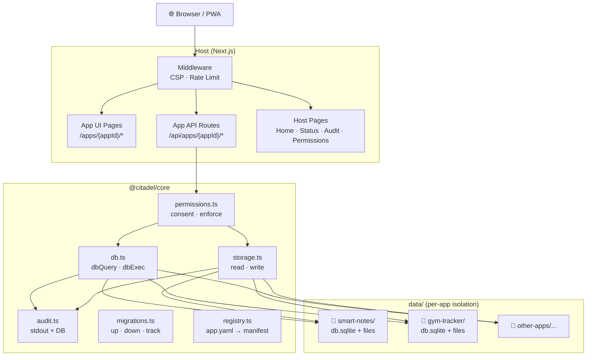
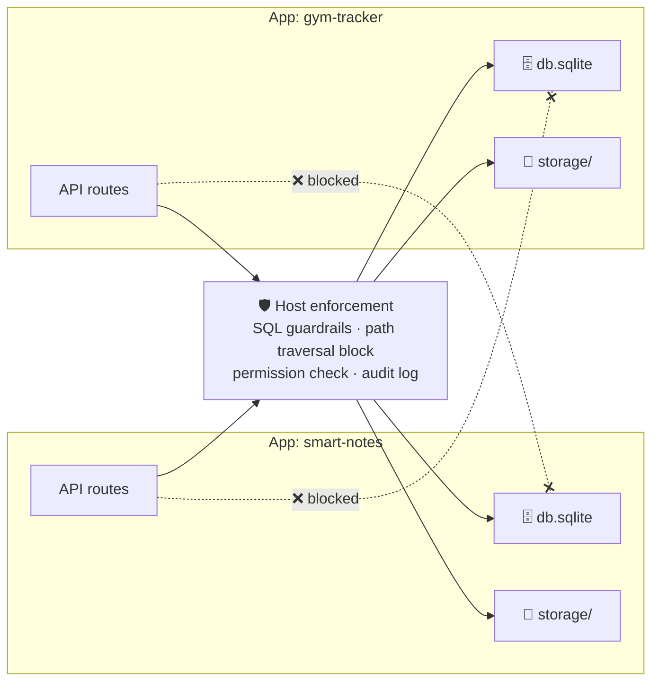
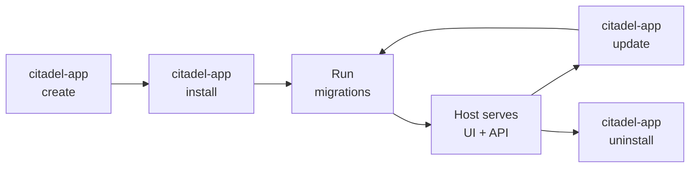

# Introduction

Citadel is a **local-first personal app hub** — a single Next.js host that runs multiple isolated apps.

## Architecture



## Repository layout

```
host/        — Next.js host shell + API gateway + permissions + audit
apps/        — App packages (app.yaml + migrations/)
core/        — @citadel/core shared library
templates/   — App starter templates (blank, crud, ai, dashboard)
scripts/     — citadel-app CLI (create, install, update, dev, migrate)
docs/        — This documentation site (VitePress)
kb/          — Project knowledge base + roadmap
data/        — Runtime data (gitignored)
```

## Isolation model



Each app gets:
- **Its own SQLite database** — no cross-app queries
- **Its own storage directory** — path traversal blocked
- **Declared permissions** — enforced on every db/storage call
- **Audit trail** — every operation logged

## App lifecycle



## Platform features

- **Permissions** — apps declare scopes in `app.yaml`; user approves on first launch
- **Isolation** — per-app SQLite DB and storage root; SQL guardrails; path traversal blocked
- **Audit** — all DB/storage/API events logged to `audit_log` table; viewer at `/audit`
- **Backup** — scheduled local backups + per-app export/import (zip)
- **PWA** — installable on iOS/Android; offline shell; responsive + dark mode
- **CLI** — `citadel-app create/install/update/dev/migrate` for app lifecycle
- **Autopilot** — AI agent that picks up scrum-board tasks and implements them autonomously

## Autopilot — AI-driven development

Citadel includes a built-in scrum board and an autopilot system that lets you describe features in plain language and have them built automatically.

```
You: "Add a voice recording button to Smart Notes"
  → Autopilot picks up the task
  → Writes the code (UI + API + migration if needed)
  → Deploys it to your running instance
  → You see the feature on your phone in seconds
```

The autopilot uses a pluggable agent runner — you can use OpenClaw, Claude Code, or a custom script. It reads the scrum board, picks up tasks marked as ready, and implements them against the app's codebase.

This is what makes Citadel a **living platform** — your apps aren't frozen after install. They evolve as fast as you can describe what you want.

## Quick start

See [Quickstart](/how-to/quickstart) to run the host and install your first app.

## Build an app

See [Build an App](/how-to/build-an-app) for a step-by-step tutorial.

## App spec

See [App Spec](/app-spec) for the full app package format reference.
