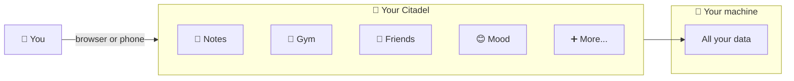

# What is Citadel?

  

Citadel is your **personal app server** — a single place on your own computer (or a small server) that runs all your personal apps.

Think of it like having your own private app store, except everything runs on hardware you own and all your data stays with you.

## Build features on the fly

This is what makes Citadel different from other self-hosted platforms.

Want voice input in your notes app? Describe it. An AI agent picks up the task, writes the code, and deploys it — you see the feature in your app in seconds, right on your phone.

Citadel includes a built-in scrum board and an **autopilot** system. You write a task like "add a voice recording button to Smart Notes." The autopilot picks it up, implements it using the app's codebase, and ships it. You come back to a working feature.

Your apps aren't static. They evolve as fast as you can describe what you want.

## The problem

Today, your personal data is scattered across dozens of services:

- Notes in Notion or Google Docs
- Workouts in a fitness app
- Mood logs in some tracker
- Friend meetups in your memory (or nowhere)

Each one is a separate account, a separate company storing your data, and a separate subscription. If the company shuts down or changes pricing, you lose access.

## How Citadel solves this

Citadel gives you a **single home page** that hosts all your personal apps:

- **Smart Notes** — take notes with your keyboard, voice, or camera
- **Gym Tracker** — log workouts and track progress
- **Friend Tracker** — remember when you last saw people
- **Mood Tracker** — daily check-ins on how you're feeling
- And more — anyone can build and share new apps

All of these run on **your machine**. Your notes, your workouts, your mood logs — they're files on your computer, not on someone else's server.

## Key ideas (no jargon)

### Your data stays with you

Every app gets its own little database on your computer. Nothing is sent to the cloud unless you explicitly set that up. If you uninstall an app, you can keep or delete the data — your choice.

### Apps ask for permission

When you open a new app for the first time, Citadel shows you what it wants access to — like "this app wants to store data" or "this app wants to use AI." You decide what to allow.

### Install and remove apps easily

Adding a new app is one command. Removing it is one command. Your other apps aren't affected. It's like installing apps on your phone, but for your personal server.

### Works on your phone too

Open Citadel in your phone's browser and add it to your home screen. It works like a regular app — no app store needed.

### Automatic backups

Citadel backs up all your data every day and keeps the last 7 backups. You can also export any single app's data as a zip file whenever you want.

## Who is this for?

- **People who care about owning their data** — no cloud lock-in
- **Tinkerers and self-hosters** — if you run a Raspberry Pi, NAS, or home server
- **Developers** — build your own apps and share them with others
- **Anyone tired of managing 20 different accounts** — one place for everything personal

## How do I access it?

Citadel runs as a website on your local network. You open it in any browser — on your laptop, phone, or tablet. If you use a VPN like Tailscale, you can access it from anywhere in the world, securely.

## Is it free?

Yes. Citadel is open-source software under the MIT license. You can use it, modify it, and share it freely.

## What do I need to run it?

- A computer that can stay on (a Raspberry Pi, old laptop, NAS, or cloud server all work)
- Node.js installed (the programming runtime it's built on)
- 10 minutes to set up

Or, if you prefer, just run one Docker command and it handles everything.

## What's next?

- If you want to try it: [Quickstart guide](/how-to/quickstart)
- If you're a developer: [Build your own app](/how-to/build-an-app)
- If you want to learn how it works under the hood: [Introduction](/intro)
